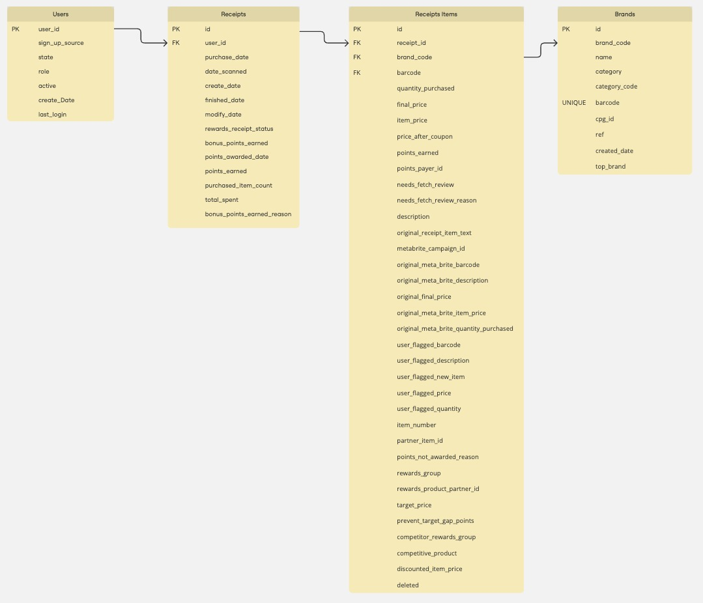

# Users Table

| Column Name    | Data Type | Key Type    | Description                                            |
| -------------- | --------- | ----------- | ------------------------------------------------------ |
| user_id        | UUID      | Primary Key | Unique identifier for the user (UUID format).          |
| sign_up_source | ENUM      |             | Source of user sign up. Values: Google, Email          |
| state          | CHAR(2)   |             | US state abbreviation (e.g., 'CA', 'NY').              |
| role           | ENUM      |             | User role. Possible values: 'consumer', 'fetch-staff'. |
| active         | BOOLEAN   |             | Indicates whether the user is currently active.        |
| create_date    | TIMESTAMP |             | Date and time when the user account was created.       |
| last_login     | TIMESTAMP |             | Date and time of the user's last login.                |

---

### Users Notes:

    It can be argued that sign_up_source can have its own table and mapped back to the User Table. I'm assuming no other sign up sources will be added given the current data.

---

# Receipts Table

| Column Name                | Data Type    | Key Type    | Description                                                                              |
| -------------------------- | ------------ | ----------- | ---------------------------------------------------------------------------------------- |
| id                         | UUID         | Primary Key | UUID for this receipt                                                                    |
| user_id                    | UUID         | Foreign Key | UUID ID of the user who submitted the receipt. Links to `users.id`                       |
| purchase_date              | TIMESTAMP    |             | The date of the purchase                                                                 |
| date_scanned               | TIMESTAMP    |             | Date that the user scanned their receipt                                                 |
| create_date                | TIMESTAMP    |             | The date that the event was created                                                      |
| finished_date              | TIMESTAMP    |             | Date that the receipt finished processing                                                |
| modify_date                | TIMESTAMP    |             | The date the event was modified                                                          |
| rewards_receipt_status     | ENUM         |             | Status of the receipt. Values: `FINISHED`, `PENDING`, `REJECTED`, `SUBMITTED`, `FLAGGED` |
| bonus_points_earned        | INT          |             | Number of bonus points that were awarded upon receipt completion                         |
| points_awarded_date        | TIMESTAMP    |             | The date we awarded points for the transaction                                           |
| points_earned              | INT          |             | The number of points earned for the receipt                                              |
| purchased_item_count       | SMALLINT     |             | Count of number of items on the receipt                                                  |
| total_spent                | DECIMAL      |             | Total amount spent                                                                       |
| bonus_points_earned_reason | VARCHAR(255) |             | Event that triggered bonus points                                                        |

---

## **Receipts Table Indexes**

| Index Name           | Column(s)                | Purpose                                       |
| -------------------- | ------------------------ | --------------------------------------------- |
| `idx_total_spent`    | `total_spent`            | Speeds up lookups by total spent              |
| `idx_purchase_date`  | `purchase_date`          | Optimizes queries filtering by purchase date  |
| `idx_receipt_status` | `rewards_receipt_status` | Speeds up status-based queries                |
| `idx_user_id`        | `user_id`                | Improves performance for user receipt lookups |
| `idx_date_scanned`   | `date_scanned`           | Optimizes searches by scan date               |

---

### Receipts Notes:

    Receipts table ID orginally is a MongoDB ObjectID and will need to be converted to a UUID.

---

# Receipt Item Table

| Column Name                            | Data Type    | Key Type    | Description                                                                               |
| -------------------------------------- | ------------ | ----------- | ----------------------------------------------------------------------------------------- |
| id                                     | UUID         | Primary Key | uuid unique identifier for each receipt                                                   |
| receipt_id                             | UUID         | Foreign Key | Links to receipts in receipt table                                                        |
| brand_code                             | VARCHAR(255) | Foreign Key | Code of brand. References brand code in brands table.                                     |
| barcode                                | VARCHAR(255) | Foreign Key | Barcode of the purchased item. References barcode in brand table.                         |
| quantity_purchased                     | TINYINT      |             | Quantity purchased                                                                        |
| final_price                            | DECIMAL      |             | Final price of the item after discounts                                                   |
| item_price                             | DECIMAL      |             | Original item price                                                                       |
| price_after_coupon                     | DECIMAL      |             | Price after applying coupon                                                               |
| points_earned                          | SMALLINT     |             | Points Earned                                                                             |
| points_payer_id                        | VARCHAR(255) |             | ID for points payer                                                                       |
| needs_fetch_review                     | BOOLEAN      |             | Whether the item requires review                                                          |
| needs_fetch_review_reason              | ENUM         |             | Reason for flag for fetch review. Values: `POINTS_GREATER_THAN_THRESHOLD`, `USER_FLAGGED` |
| description                            | TEXT         |             | Description of the purchased item                                                         |
| original_receipt_item_text             | TEXT         |             | Text from original receipt                                                                |
| metabrite_campaign_id                  | TEXT         |             | Campaign Id for metabrite                                                                 |
| original_meta_brite_barcode            | VARCHAR(255) |             | Orginal meta brite barcode                                                                |
| original_meta_brite_description        | TEXT         |             | Description of meta brite barcode                                                         |
| original_final_price                   | DECIMAL      |             | Original final price                                                                      |
| original_meta_brite_item_price         | DECIMAL      |             | Original meta brite price                                                                 |
| original_meta_brite_quantity_purchased | SMALLINT(50) |             | Meta brite quantity purchased                                                             |
| user_flagged_barcode                   | VARCHAR(255) |             | User-submitted barcode (if flagged)                                                       |
| user_flagged_description               | TEXT         |             | Description why it is flagged                                                             |
| user_flagged_new_item                  | BOOLEAN      |             | When user flags new item                                                                  |
| user_flagged_price                     | DECIMAL      |             | When user flags price                                                                     |
| user_flagged_quantity                  | TINYINT      |             | When user flags quantity                                                                  |
| item_number                            | VARCHAR(125) |             | Item number of product                                                                    |
| partner_item_id                        | VARCHAR(50)  |             | Partner's item ID for reference                                                           |
| points_not_awarded_reason              | TEXT         |             | Reason points were not rewarded                                                           |
| rewards_group                          | TEXT         |             | Reward group description                                                                  |
| rewards_product_partner_id             | VARCHAR(255) |             | ID of rewards product partner                                                             |
| target_price                           | TINYTEXT     |             | Target price                                                                              |
| prevent_target_gap_points              | BOOLEAN      |             | Flag to prevent awarding target gap points                                                |
| competitor_rewards_group               | TEXT         |             | Competitor reward group                                                                   |
| competitive_product                    | BOOLEAN      |             | Is it a competitive product                                                               |
| discounted_item_price                  | DECIMAL      |             | Price of discounted Item                                                                  |
| deleted                                | BOOLEAN      |             | Was item deleted                                                                          |

---

## **Receipt Item Table Indexes**

| Index Name       | Column(s)    | Purpose                                  |
| ---------------- | ------------ | ---------------------------------------- |
| `idx_receipt_id` | `receipt_id` | Optimizes joins with `receipts` table    |
| `idx_brand_code` | `brand_code` | Speeds up queries filtering by brand     |
| `idx_barcode`    | `barcode`    | Improves performance for barcode lookups |

---

#### Receipt Item Notes:

    Barcode is a VARCHAR instead of a INT because it leads with a zero in some cases. Moreover, before querying the data I do n't know if there are any letters in the barcode.

---

# Brands Table

| Column Name   | Data Type    | Key Type    | Description                                              |
| ------------- | ------------ | ----------- | -------------------------------------------------------- |
| id            | UUID         | Primary Key | UUID for the brand. This is the unique ID for the brand  |
| brand_code    | VARCHAR(255) |             | Code of brand                                            |
| name          | VARCHAR(255) |             | Name of brand                                            |
| category      | VARCHAR(255) |             | Category of brand                                        |
| category_code | VARCHAR(255) |             | Category code of brand                                   |
| barcode       | VARCHAR(255) | UNIQUE      | Barcode of the purchased item                            |
| cpg_id        | UUID         |             | ID to possible CPG table.                                |
| ref           | ENUM         |             | Ref of brand. Values: `Cpgs`, `Cogs`                     |
| created_date  | TIMESTAMP    |             | Date when brand was added (default to current timestamp) |
| top_brand     | BOOLEAN      |             | Boolean flag indicating if this is a top brand           |

---

## **Brand Table Indexes**

| Index Name       | Column(s)    | Purpose                                      |
| ---------------- | ------------ | -------------------------------------------- |
| `idx_brand_code` | `brand_code` | Speeds up lookups by brand code              |
| `idx_barcode`    | `barcode`    | Speeds up barcode-based queries              |
| `idx_cpg_id`     | `cpg_id`     | Optimizes foreign key joins with `cpg` table |

---

### Brands Notes:

    Not sure what the cpg_id is used for. Could it link to a separate table? If so, it can be a foreign key.

---

